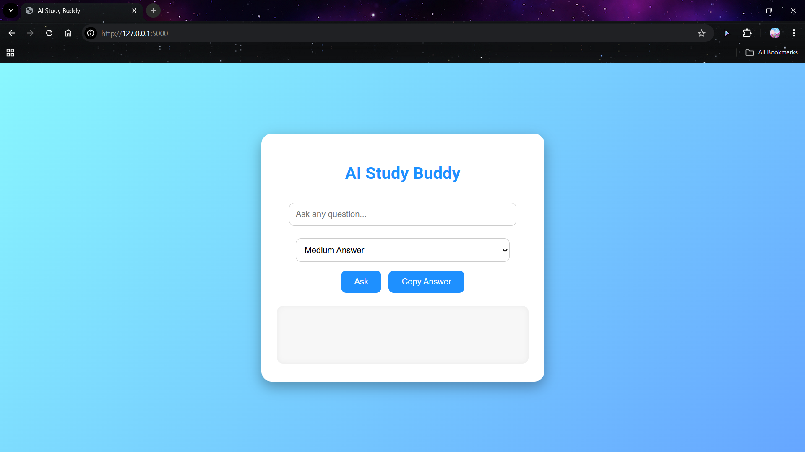

# AI Study Buddy

AI Study Buddy is a prototype web application designed to help students study more effectively using AI-powered responses and OCR-based text extraction.

## Demo

## Features

* Ask study-related questions
* Generate AI-powered responses
* Adjustable answer length
* Upload study materials or images
* Extract text using OCR

## Tech Stack

* Python
* Flask
* HTML/CSS
* OpenAI API
* OCR (pytesseract or similar library)

## Project Structure

* `app.py` – Main application
* `ocr_test.py` – OCR testing script
* `templates/` – HTML frontend
* `uploads/` – Temporary uploaded files

## Setup

Install dependencies:

pip install -r requirements.txt

Run the application:

python app.py

Note: AI responses require an OpenAI API key with available credits.

## Hackathon Project

This project was created as a prototype during an online hackathon to explore how AI tools can support student learning. It was built using rapid prototyping and AI-assisted development.
